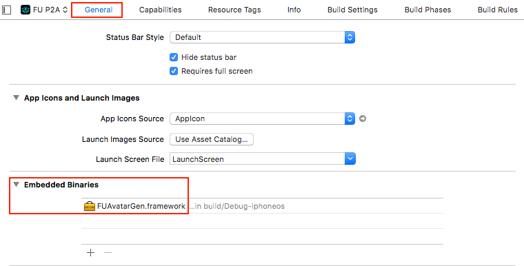

# FUAvatarGen

## 简介
`FUAvartarGen`是负责客户端与P2A（Photo-to-Avatar）云服务器交互的SDK：提交一张照片，返回avatar相关数据的zip。

## 获取证书
您需要拥有我司颁发的用于生成avatar的证书才能使用我们的SDK的功能，如您未获得相关证书请拨打电话 **0571-89774660** 进行咨询。

## Android SDK接口文档
### 添加库依赖

- 把`fuavatargen.aar`文件放在一个文件目录内，比如就放在libs目录内
- 在项目的build.gradle文件添加如下内容

	```
	repositories {
	    flatDir {
	        dirs 'libs' //this way we can find the .aar file in libs folder
	    }
	}
	```	
- 在APP模块的build.gradle添加如下内容

	```
	dependencies {
   		compile(name:'fuavatargen', ext:'aar')
	}
	```

### 初始化

函数原型为:
	
```
public static void setup(final Context context, final byte[] authpack, final String rootUrl, final byte[] ca);
```
参数解释：

- `context` Activity或Application的Context均可；如为null会在外部存储空间生成临时文件，反之在app data目录生成临时文件，用完即删。
- `authpack` 由我司颁发的证书，**注：非nama鉴权证书**。
- `rootUrl` 云服务器地址
-  `ca` ca证书，避免部分手机自带ca不全


### 提交照片生成Avatar

函数原型：

```
public static void request(File uploadFile, P2ACallback callback)
```
参数解释：

- `uploadFile` 包含人像的图片
- `noBody` 是否同时创建没有身体的 avatar
- `avatarData` 是否获取avatar的模型数据
- `callback` 回调

#### 回调

```
public interface P2ACallback {
    /**
     * 生成失败
     * @param error 失败原因
     */
    void onFailure(String error);

    /**
     * 生成成功
     * @param bytes 返回Avatar相关文件
     */
    void onSuccess(byte[] bytes);

    /**
     * 生成进度
     * @param value 进度
     * @param max 进度最大值
     */
    void onProgress(int value, int max);
}
```

其中，`onSuccess(byte[] bytes)`回调的bytes为zip文件字节内容。

### 续费avatar

函数原型

```
public static void renew(final File avatarFile, final P2ACallback callback);
```
callback和request类似，其中，`onSuccess(byte[] bytes)`回调的bytes为续费后avatar bundle文件字节内容。

## iOS SDK接口文档
### 集成 FUAvatarGen

将 FUAvatarGen.framework 添加到工程中，特别注意的是 FUAvatarGen.framework 是动态库，需要在 Embedded Binaries 中 添加 FUAvatarGen.framework 依赖。如图：



### 初始化

初始化接口：

	+ (void)setupWithAuthPackage:(void *)package authSize:(int)size;

参数说明：

`package ` 鉴权证书数组地址

`size` 鉴权证书数组的大小

调用示例：

首先在代码中引入 FUAvatarGen.h 头文件及鉴权证书头文件 authpack_p12.h

```objc
#import <FUAvatarGen/FUAvatarGen.h>
#import "authpack_p12.h"
```

然后执行初始化

```objc
[FUAvatarGen setupWithAuthPackage:g_auth_package authSize:sizeof(g_auth_package)];

```

### 设置 URL

设置网络请求的 URL，如果不调用该接口，在生成 avatar 时会访问内置的 URL

	/**
	 设置网络请求地址及端口号，如果不设置会使用内部默认域名
	
	 @param hostUrl 网络请求地址及端口号，格式为"https://host:port"
	 */
	+ (void)setHostUrl:(NSString *)hostUrl;
	
### 创建 avatar

生成 avatar 接口：
	
	+ (void)requestWithImage:(UIImage *)image
                  noBody:(BOOL)noBody
                progress:(void (^)(float progress))createProgress
                 success:(void (^)(NSData *data, NSURLResponse *response))success
                 failure:(void (^)(NSError *error))failure;
   
参数说明：

`image ` 包含人像的图片

`noBody ` 是否同时创建没有身体的 avatar

`avatarData ` 是否获取avatar的模型数据

`createProgress ` 创建进度block

`success ` 创建成功的block，如果成功将会返回一个包含avtar道具的zip包

`failure ` 创建失败的block，如果失败会返回一个NSError，可以通过该error查看失败原因

调用示例：

```objc
[FUAvatarGen requestWithImage:image noBody:YES progress:^(float progress) {
    NSLog(@"progress: %f", progress);
} success:^(NSData *data, NSURLResponse *response) {
    
    NSString *cachesPath = [NSSearchPathForDirectoriesInDomains(NSDocumentDirectory, NSUserDomainMask, YES) lastObject];
    
    NSString *zipPath = [cachesPath stringByAppendingPathComponent:@"tmp.zip"];
    
    [[NSFileManager defaultManager] createFileAtPath:zipPath contents:data attributes:NULL];
    
    //然后进行解压即可
    
} failure:^(NSError *error) {
    NSLog(@"%@",error.description);
}];

```

### avatar 续费

avatar 续费接口：
	
	+ (void)renewAvatarWithfilePath:(NSString *)path
                        success:(void (^)(NSData *data, NSURLResponse *response))success
                        failure:(void (^)(NSError *error))failure;

参数说明：

`path ` 包含人像的图片

`success ` 创建成功的block，如果成功将会返回一个 new_avatar.bundle

`failure ` 创建失败的block，如果失败会返回一个NSError，可以通过该error查看失败原因

调用示例：

```objc

NSString *path = [[NSBundle mainBundle] pathForResource:@"oldAvatar.bundle" ofType:nil];

[FUAvatarGen renewAvatarWithfilePath:path success:^(NSData *data, NSURLResponse *response) {
    //data 即为 new_avatar.bundle 的数据文件
} failure:^(NSError *error) {
    NSLog(@"%@",error.description);
}];
```
